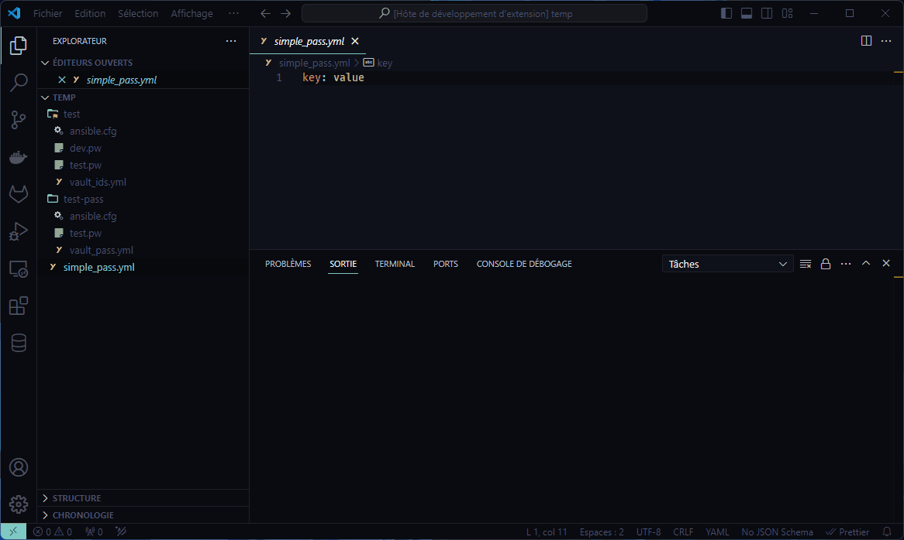
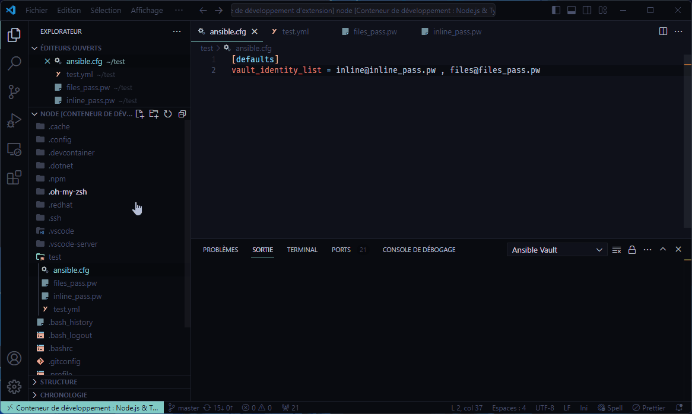

# Ansible Vault for Visual Studio Code

## Overview

The Ansible Vault VS Code Extension simplifies the encryption and decryption of Ansible Vault files within the Visual Studio Code environment. This extension empowers users to encrypt and decrypt text selections or entire files effortlessly, manage vault identities, and configure encryption settings directly within VS Code.

## Demonstration

## Features

- **Toggle Encryption/Decryption**: Encrypt or decrypt selected text or entire files with ease using a single command.
- **Automatic Vault Configuration**: Automatically detects and utilizes Ansible configuration settings (e.g., vault password file, vault identity list) from `ansible.cfg`.
- **Custom Vault Configuration**: Allows users to specify custom vault settings directly within VS Code configuration.
- **Manage Vault Identities**: Easily choose and manage vault identities for encryption and decryption.

## Usage

1. Open a file in Visual Studio Code.
2. Select the text you want to encrypt or decrypt, or leave it blank to encrypt/decrypt the entire file.
3. Utilize the available commands in the command palette or toolbar to perform encryption or decryption.

## Requirements

This extension only requires Visual Studio Code. It does not rely on Python or Ansible local packages for encryption and decryption.

## Installation

1. Open Visual Studio Code.
2. Navigate to the Extensions view (`Ctrl+Shift+X`).
3. Search for "Ansible Vault" and install the extension.

## Configuration and Commands

### Configuration Settings

Customize the behavior of the Ansible Vault extension by configuring the following properties in your `settings.json`:

- **ansibleVault.executable**: Specify the full path of the ansible-vault executable.
- **ansibleVault.keyPass**: Set the ansible-vault password text.
- **ansibleVault.keyFile**: Specify the path to the ansible-vault password file or vault-identity-list.
- **ansibleVault.encryptVaultId**: Define the ansible-vault vault ID for encryption.

### Available Commands

Access the following commands from the Command Palette:

- **Ansible Vault - Encrypt & Decrypt**: Encrypt and decrypt Ansible vault files.
- **Remember vault ID for encryption with ansible-vault**: Remember the vault ID for encryption.
- **Reset vault ID setting for ansible-vault**: Reset the vault ID setting.

### Menus and Keybindings

The extension adds options to the context menus in the Explorer and Editor views and provides keybindings for quick access to Ansible Vault commands.

### Codelens

Inline helpers are available when you vault is encrypted. Your editor language bust be `YAML` or `Ansible` (provided by official Ansible extension).

## Utilization of Ansible Configuration

The extension locates ansible.cfg files in the project workspace and its parent directories to extract configuration settings related to Ansible Vault. It scans these files to find vault_password_file and vault_identity_list settings, which are then utilized for encryption and decryption.

If the extension cannot find the specified path for the Ansible Vault password file, it will use on POSIX the following default paths:

1. `~/.ansible.cfg`
2. `/etc/ansible.cfg`

### Path Search Algorithm

The extension employs a path search algorithm that starts from the current file's directory and traverses upwards until it finds an `ansible.cfg` file. This algorithm ensures compatibility with both POSIX and Windows file paths.

### Configuration Settings Extraction

Once an `ansible.cfg` file is found, the extension extracts relevant configuration settings such as `vault_password_file` and `vault_identity_list`. These settings are then used to determine the password file and vault identities needed for encryption and decryption.

## Additional Information

- [Ansible®](https://docs.ansible.com/ansible/latest/dev_guide/style_guide/trademarks.html) is a registered trademark of [RedHat®](https://www.redhat.com/en).
- This extension was forked from [Wolfmah / vscode-ansible-vault-inline](https://gitlab.com/wolfmah/vscode-ansible-vault-inline).

## License

This project is licensed under the MIT License - see the [LICENSE.md](https://gitlab.com/wolfmah/vscode-ansible-vault/-/blob/HEAD/LICENSE.md) file for details.
